

<!-- _class: lead -->

# 位相的データ解析の紹介

MT部 DSチーム 山本
2025/11/13

---

# **T**opological **D**ata **A**nalysis (**TDA**)

トポロジー（位相幾何学）を用いてデータの「形」を分析する手法の総称

 
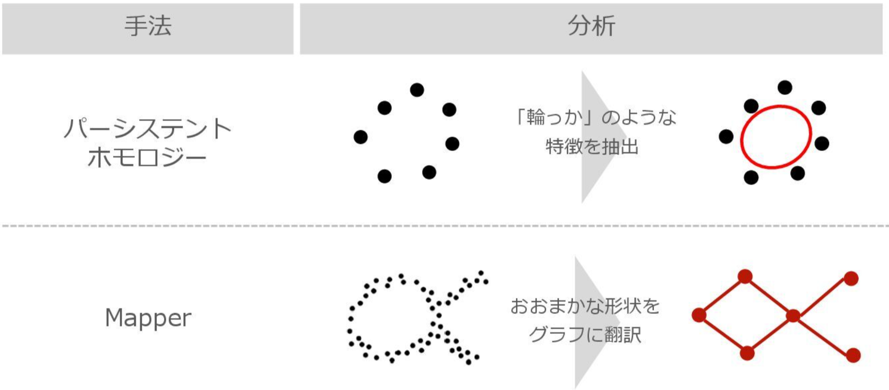

---
<!-- _class: lead -->

# Persistent Homology

---
# 単体復体

- $k$ 単体 $\lvert p_0 p_1 \cdots p_k \rvert = \{x \in \mathbb{R}^k \mid x = \sum_{i = 0}^{k} \lambda_i p_i, \sum_{i=0}^{k}\lambda_i = 1\}$
  - 例: 0単体（点）、1単体（辺）、2単体（正三角形）、3単体（四面体）
  - 例: 2単体 $\lvert p_0p_1p_2 \rvert$ は、7つの面 $|p_0|, |p_1|, |p_2|, |p_0p_1|, |p_0p_2|, |p_1p_2|, |p_0p_1p_2|$ をもつ。
- 有限個の単体の集まり $K$ が次の条件を満たす時、**単体復体**と呼ぶ:
  1. $K$ に属する単体 $\tau$ の面 $\sigma$ もまた $K$ に含まれる
  1. 2 つの単体 $\tau, \sigma \in K$ の空でない共通部分 $\tau \cap \sigma$ は $\tau$ の面であり、$\sigma$ の面でもある

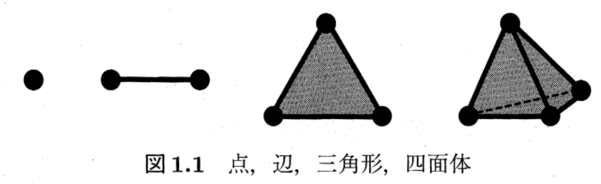

---
# Homology

- 1単体が作る「穴」=「**境界**のない1単体の集まりであって2単体の集まりの**境界**になっていないもの」

- $n$ 次元単体復体 $K$ に属する $k$ 単体の集まりを $K_k$ とし、$k$鎖群（$K_k$ で生成される自由 $\mathbb{Z}$ 加群）$C_k (K)$ を定義:

  $$
  C_k (K) = \left\{ c = \sum_{\sigma \in K_k} \alpha_{\sigma} \langle \sigma \rangle  \middle| a_{\sigma} \in \mathbb{Z} \right\}
  $$
- 境界作用素 $\partial_k: C_{k}(K) \to C_{k-1} (K)$ を定義すると、
  - $\mathrm{Ker} \partial_{k} = \{\sigma \in C_k (K) \mid \partial_k (\sigma) = 0\}$ は境界のない $k$ 単体
  - $\mathrm{Im} \partial_{k} = \{\sigma \in C_k (K) \mid \sigma = \partial_k (\tau), \tau \in C_{k+1} (K)\}$ は $k+1$単体 の境界となっている $k$ 単体
  - $k$ 次のホモロジー群: $H_k (K) = \mathrm{Ker} \partial_{k} / \mathrm{Im} \partial_{k+1}$

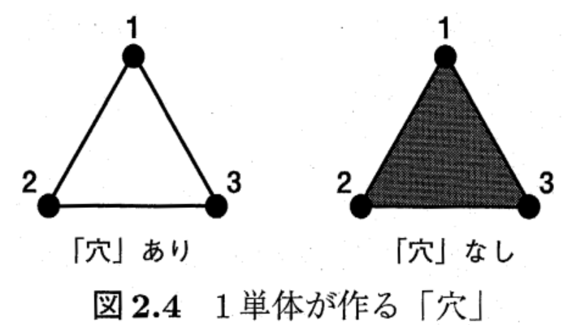

---

# Persistent Homology（パーシステントホモロジー）

- 点群 $X$ の「形状」を抽出する手法
- 各点 $x \in X$ を中心とした半径 $r$ の集合 $B(X; r) = \bigcup_{x \in X} B(\bm{x}_i; r)$ に対して、$r$ を大きくしていくとフィルトレーションを得る:
  $$
  \mathbb{B} (X): \cdots \subset B(X; a) \subset B(X; b)\subset \cdots \quad (a < b)
  $$
- ホモロジー群の系列（**$q$ 次元パーシステントホモロジー**）も得る:
  $$
  H_q (\mathbb{B} (X)): \cdots \to H_q(B(X; a)) \xrightarrow{u^{b}_{a}} H_q(B(X; b)) \to \cdots \quad (a < b)
  $$
- 分解定理により $H_q (\mathbb{B} (X)) \simeq \bigoplus_{ i\in I} \mathbb{I}[b_i, d_i]$ と区間表現でき、これを $\mathbb{R}^2$ に表示した多重集合 $D_q (X) = \{(b_i, d_i) \mid i \in I\}$を **$q$ 次元パーシステントダイアグラム** と呼ぶ。

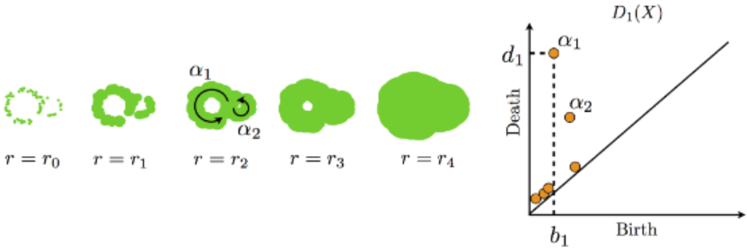

---

# Persistent Homology の具体例

- パーシステントホモロジーとは「各点を太らせたときにできる"穴"の生成消滅の系列」とざっくり理解
- 例えば、
  - $r = b_1$ のとき、穴 $\alpha_1$ が発生
  - $r = b_2$ のとき、穴 $\alpha_2$ が発生
  - $r = d_2$ のとき、穴 $\alpha_2$ 消滅
  - $r = d_1$ のとき、穴 $\alpha_2$ が消滅

---

# Persistent Homology の魅力の一部分

- フィルトレーションを構成できれば、点群以外のあらゆるデータに対してパーシステントホモロジーを計算可能
- 摂動でパーシステントダイアグラム（PD）は大きく変わらない
   - PD の安定性解析も主テーマとなっている（例: $d_b (D(\mathcal{C} (X)), D(\mathcal{C} (X))) \le d_H (X, Y)$）

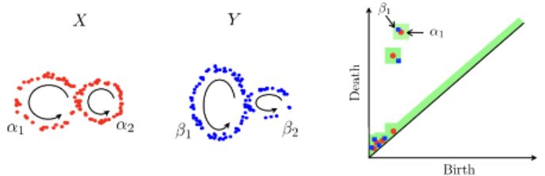

- TDA X 統計的機械学習の分野も盛ん

---
<!-- _class: lead -->

# Persistent Homology の応用例

---

# 金融危機予兆（異常検知）への応用

- [Gidea and Katz 2018](https://arxiv.org/abs/1703.04385) は金融市場にパーシステントホモロジーを適応した草分け的な研究
  - 米国株式指数（S&P500など）の日次リターン系列を対象に分析
    - 時系列 $\to$ 遅延座標埋め込み $\to$ 1次のPD $\to$ パーシステントランドスケープの $L^p$ 距離（位相的構造の全体的な大きさを示す指標）
  - (a)ドットコムバブル崩壊（2000年）および(b)リーマン・ショック（2008年）期で$L^p$ の時系列の低周波成分が統計的優位に上昇
  - 右図は、各ショックの250日以前の（上）$L^p$ 指標と（下）VIX に対して、（左）低周波成分が分散、（中央）低周波成分の平均、（右）1次の自己相関を示している
- 暗号通貨（[Gidea+2020](https://arxiv.org/abs/1809.00695)）、PH特徴量を機械学習モデルに利用（[Guritanu+2025](https://www.mdpi.com/2073-431X/14/10/408)）など類似研究は割とある

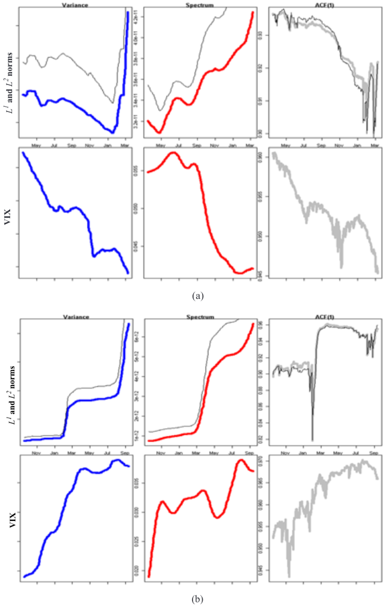

---

# Takens の埋め込み定理

- 力学系 $f: M \to M$ と 観測関数 $g: M \to \mathbb{R}$ を考える:
  $$
  x_{t+1} = f (x_t), \quad s_t = g (x_t)
  $$

- **時間遅れ座標** $\Phi_{(f, g)}: M \to \mathbb{R}^{2m+1}$ は埋め込みとなる:
  $$
  \Phi_{(f, g)} (x) = (g(x), g(f(x)), \ldots, g(f^{2m}(x)))
  $$

- 例えば、米国の株式市場の「状態」$x_t$ を株価指数（S&P500など）$s_t$ で観測した場合、時間遅れ座標 $(s_{t}, s_{t+\tau}, \ldots, s_{t + 2m \tau})$ で$x_t$ の挙動を再現できる。

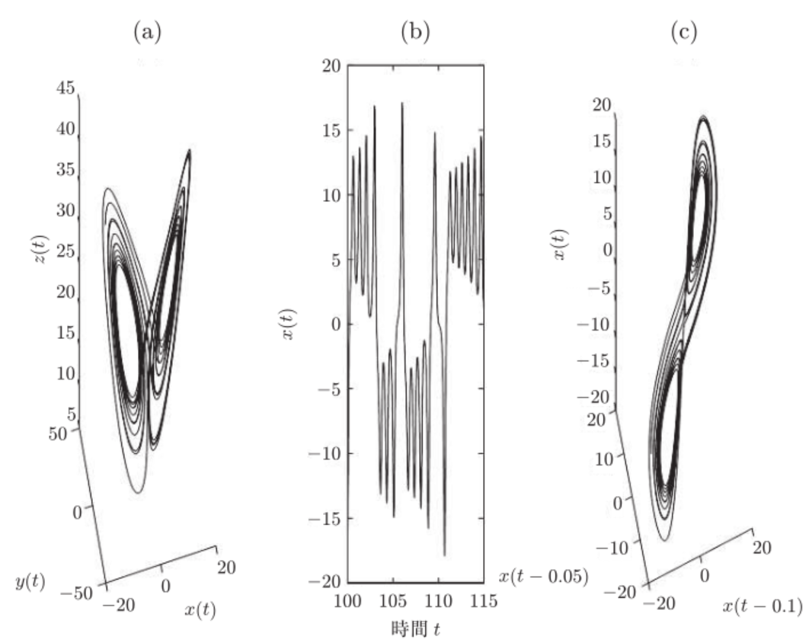

---
<!-- _class: lead -->

# Persistent Homology を遊んでみたかった

---

# 金融時系列への応用

すみません。間に合いませんでした。今後進展あったら共有します。

- 先行研究同様に、金融時系列の遅延座標埋め込みに対してTDAを実施
- 銘柄間や指標間の相関行列（距離行列 $d_{ij} = \sqrt{1 - \rho_{ij}^2}$）に対して閾値を設けることで、フィルトレーションを構築しTDAを実施

---
<!-- _class: lead -->

# Mapper

---

# Mapper

データの特徴となる部分を把握しやすようにグラフとして表示する手法

 
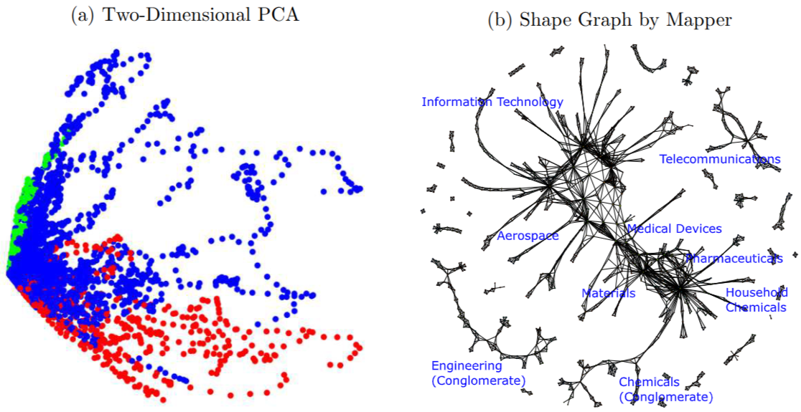

---

# Mapper のアルゴリズム

1. 点群 $X$ から低次元空間 $\mathbb{R}^k$ への写像 $f: X \to \mathbb{R}^k$ を与える
1. 像 $f (X)$ の被覆 $f (X) \subset \bigcup_{i} C_i$  を考えて、その逆像に$f^{-1} (C_i)$ により $X$ を分割する
1. 各逆像 $f^{-1} (C_i) \, (i = 0, 1, \ldots)$ ごとにクラスタリングする:
    $$
    f^{-1} (C_i) = \bigsqcup_{j} V_{i, j}
    $$
1. $V_{i, j}$ をノードとして、2 頂点 $U, V$ が元のデータ空間 $X$ で共通部分を持つときエッジをはる

 
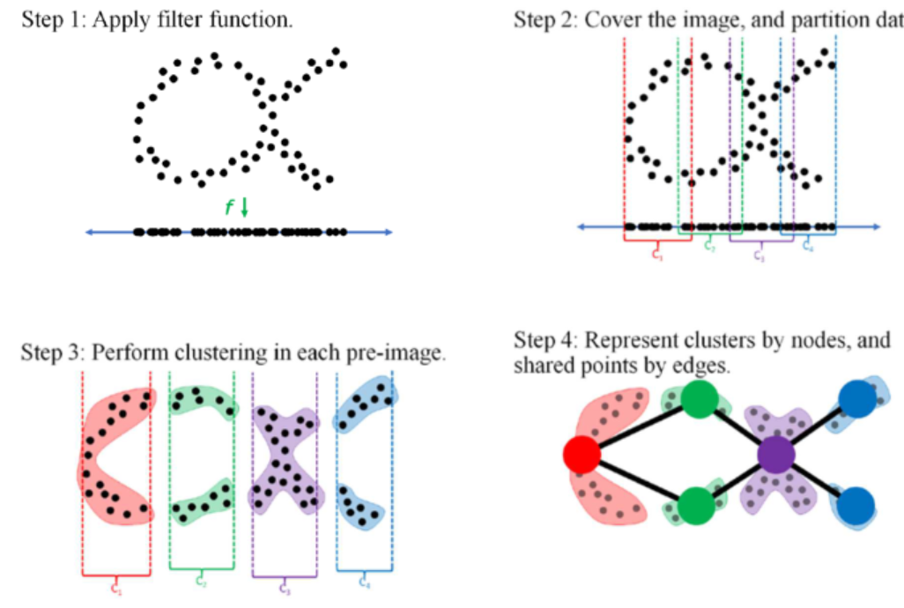

---

# Mapper の応用

- [Escolar+2022](https://arxiv.org/pdf/1909.00257) では、企業の特許データを利用して、企業の技術戦略の可視化を実施。
- $X = \{p_{i, t} =  (p_{i, t, 1}, \ldots, p_{i, t, S}) \in \mathbb{R}^S \mid i=1, \ldots, F,  t = 0,\ldots,T\}$
  - $S$ 個の特許カテゴリ、$F$ 個の企業数、$T$ ステップ

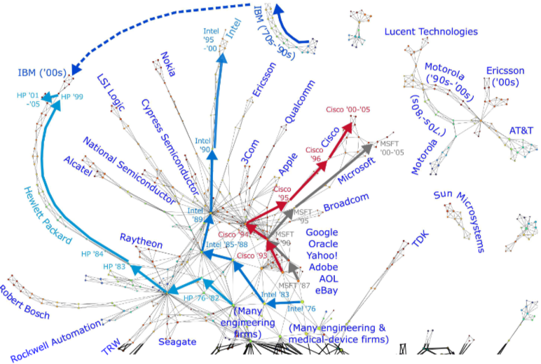

---
<!-- _class: lead -->

# 参考図書とOSS

---

# TDA の参考図書

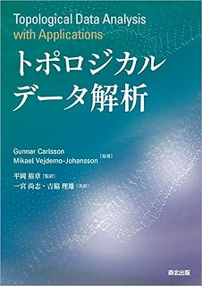

- TDA の代表的な教科書
- 内容は難しいが、応用例が豊富

- Persistent Homology が中心
- 内容は難しいが、応用例が豊富

- Persistent Homology の入門書
- 学部程度の線形代数の知識で入門できることがありがたい

---

# TDA OSS

### [GUDHI](https://github.com/GUDHI)

- C++ ライブラリ
- Pythonモジュールも提供
- Persistent Homology がメイン
- 様々なタイプの復体やデータ構造に対応

### [Giotto-tda](https://github.com/giotto-ai/giotto-tda?tab=readme-ov-file)

- Scikit-learn に準拠
- Persistent Homology, Mapper に対応

### [Ripser](https://github.com/Ripser/ripser)

- Vietoris-Rips 複体に対するパーシステントホモロジーを高速に計算するソフトウェア

### [RIVET](https://github.com/rivetTDA/rivet)

- 2 パーシステント加群に対応

